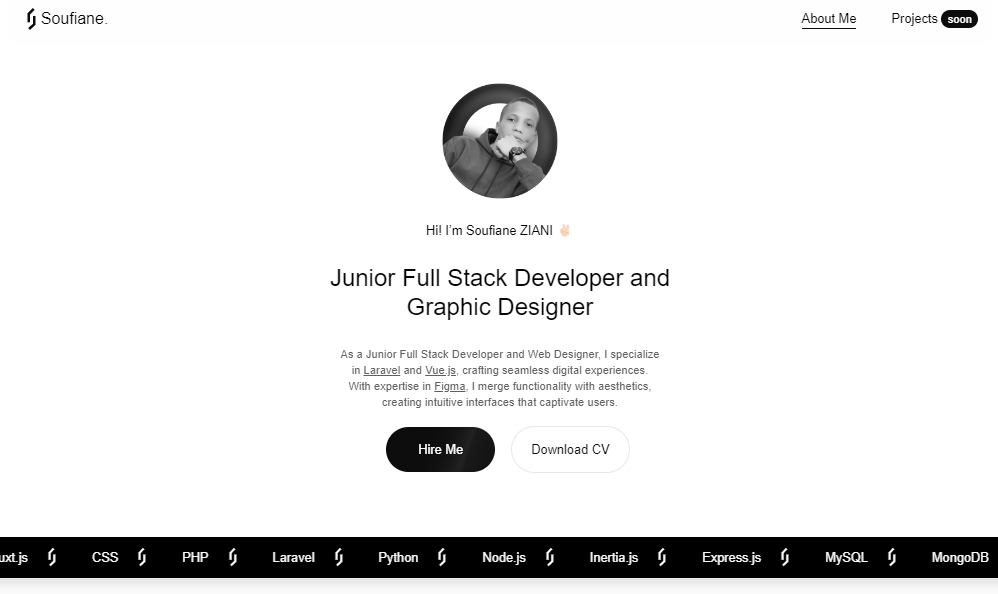

# Portfolio Website

## Implemented Features

- [x] Responsive design for optimal viewing on different devices.
- [x] Dynamic portfolio showcasing your projects.
- [x] Contact form for easy communication.
- [x] About page introducing yourself and your skills.
- [x] Blog section to share your thoughts and experiences.
- [x] Integrated animations and transitions for a smooth user experience.

## Technologies Used

- [Nuxt.js](https://nuxt.com/) for the front-end development.
- [Tailwind CSS](https://tailwindcss.com/) for styling and responsive design.
- [Vue.js](https://vuejs.org/) for JavaScript framework.
- npm or yarn as the package manager.

## Home Page Image

Here's an image showcasing your portfolio website's home page:

Make sure the image path matches the actual location of the image in your project directory.

## Visit My Portfolio

You can visit my portfolio at [https://soufianeziani.netlify.app](https://soufianeziani.netlify.app).
